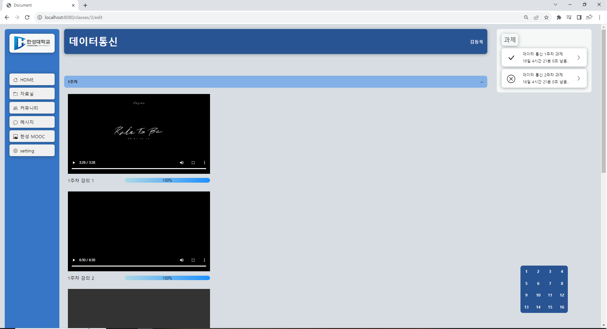

<div align="center"><h1>한성대 공학경진대회 팀 JBUGS</h1></div>
<div align="center"><h3>E class 개선안</h3></div><br>


```geojson
{
  "type": "FeatureCollection",
  "features": [
    {
      "type": "Feature",
      "id": 1,
      "properties": {
        "ID": 0
      },
      "geometry": {
        "type": "Polygon",
        "coordinates": [
          [
              [-90,35],
              [-90,30],
              [-85,30],
              [-85,35],
              [-90,35]
          ]
        ]
      }
    }
  ]
}
```
## 🔔 작품 소개
E class+는 코로나 19 이후 대학 교육 환경에서 급속히 증가하는 블렌디드 수업과 온라인 학습의 필요성을 고려하여 개발된 혁신적인 교육 플랫폼입니다.

이 프로젝트는 한성대학교의 기존 eclass 플랫폼에서 발생한 불편함을 해소하고 학생들의 학습 경험을 향상시키기 위해 개발되었습니다.

## 기존 Eclass에 대한 학생들의 불편 사항
* __메인페이지__
1. 과제 확인이 어렵다.
2. UI가 깔끔하지만 불필요한 기능이 많아보인다.
  
* __강의페이지__
1. 주차가 거듭될수록 마우스 드래그의 횟수가 늘어난다.
2. 불필요한 기능이 많아보인다.
3. 강의와 과제가 섞여 나오는 경우가 있어 불편하다.

## 📄주요 기능 및 특징

* __수업 진도율 표시__
  * E class+는 진행도를 시각적으로 표시하여 학생들이 수업 진행 상황을 한눈에 파악할 수 있도록 지원합니다. 이를 통해 개인의 학습 현황을 더욱 효과적으로 관리할 수 있습니다.

* __과제의 남은 일수 표시__
  * 프로젝트는 과제의 제출 기한을 나타내어 학생들이 어떤 과제가 더 시급하게 처리되어야 하는지 알려줍니다. 이를 통해 과제 미제출을 방지하고 학업 성취도를 높일 수 있습니다.

* __UI/UX 사용자 경험 개선__
  *  E class+는 사용자 경험을 개선하기 위한 진보된 사용자 인터페이스를 제공합니다. 직관적이고 사용하기 쉬운 디자인을 통해 학생들이 플랫폼을 보다 편리하게 이용할 수 있습니다.

* __AI 기반 강의 자료 추출 및 연습문제 생성__
  * E class+는 구글 클라우드 비전 OCR 및 구글 비디오 인텔리전스와 같은 첨단 기술을 활용하여 강의 자료를 텍스트로 추출합니다. 그 후, OpenAI GPT API를 활용하여 추출된 텍스트를 기반으로 연습 문제를 자동으로 생성합니다. 이를 통해 학생들은 수업 이해도를 높일 수 있으며, 효율적인 학습을 지원합니다.


## ✔개선된 페이지
* __메인 페이지__
<div align="center">
 
 <p>
 캘린더 추가 / 과제 표시 / UI 간결화
</p>
</div>
<br>
<br>
 
* __강의 페이지__
<div align="center">


<p>
 아코디언바 추가 / 강의 진도율 시각화 / Sticky Bar를 통한 주차별 이동 간결화
</p>
</div>
<br>
<br>

* __퀴즈 페이지__
<div align="center">

<p>
 모듈을 통한 퀴즈 생성 / 키워드 추출 후 생성
</p>
</div>


## ⚙퀴즈 생성 모듈 구조
<div align="center">

</div>

## ⌨주요 적용 기술 및 특이 사항
* __개발 도구__ : Visual Studio Code, Intellij IDEA 23.2, Spring Boot, Mysql
* __개발 언어__ : HTML5, CSS3, JavaScript, Node.js, Java
* __주요 적용 기술__ : fullcalendar를 통해 일정 입력이 가능한 달력을 구현, Spring Data JPA, nodejs 의 pdf2pic라이브러리를 통한 pdf – jpg변환, 구글 클라우드 비전 OCR(광학문자인식), 구글 비디오 인텔리전스(텍스트 추출), openAI gpt API를 통한 키워드를 이용한 연습문제 출제

## ✋개발 팀원

|Frontend|Frontend|Backend|Module|
|------|---|---|---|
|최재완|이영재|장주찬|김정훈|
